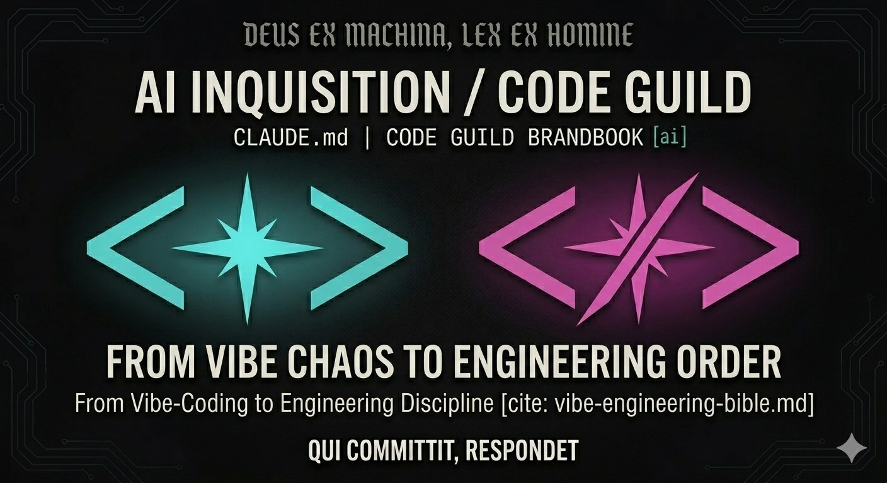

# Vibe engineering bible

A policy for working with AI assistants (Claude Code, Cursor, Codex, Claude Cowork,
and others) for teams of any size — solo developer, OSS maintainer, a team of 5
or 5000 people. This is a documentation-only repo: no code, tests, or build here.

## Contents

- **[`vibe-engineering-bible.md`](./vibe-engineering-bible.md)** — the canonical "bible". Structured as two covenants: the **Covenant of Freedom** (T0, vibe coding) sets minimal rules for personal experiments; the **Covenant of Discipline** (T1+, vibe engineering) covers eight commandments, thirteen sins (§4½, a normalized shortcode vocabulary for merge rejections), DoD by tier, spec-driven workflow, an AI-code reviewer checklist, the baseline template, scaling KPIs, and a glossary. Sources for figures and cases are in Appendix D.
- **[`templates/CLAUDE.md.template.md`](./templates/CLAUDE.md.template.md)** — baseline template for AI agents in a product repo. Applies to a team of any size.

## How to use

**Product-repo teams.**

1. Copy `templates/CLAUDE.md.template.md` into the root of your repo as `CLAUDE.md` (for Claude Code) and/or `AGENTS.md` (for Codex/Cursor/others that support `agents.md`).
2. Fill in section 8 ("Repo-specific") only. Sections 1–7 are the shared baseline — do not edit them.
3. Cross-reference your tier's DoD (T1/T2/T3) against §5 of the bible.

**External readers.** The bible core (§§1–10) is self-contained: eight commandments, thirteen sins with shortcodes, a DoD table, a reviewer checklist, and scaling KPIs.

**Contributors (editing the bible or template).**

- When editing one file, check the other for semantic consistency — the cross-file mapping is documented in `CLAUDE.md` (project instructions).
- Editing principles: brevity over completeness, imperative over description, concrete over ideological. See `CLAUDE.md` for details.
- Sources for figures in §1 and §4½ live in Appendix D of the bible. Change figures only when a newer version of the research appears, and update the link in the same commit.
- Commits follow Conventional Commits (`feat`, `fix`, `chore`, `docs`).

## Owner

The owner of the AI-code policy in your team or organization. The shared baseline is reviewed quarterly.
