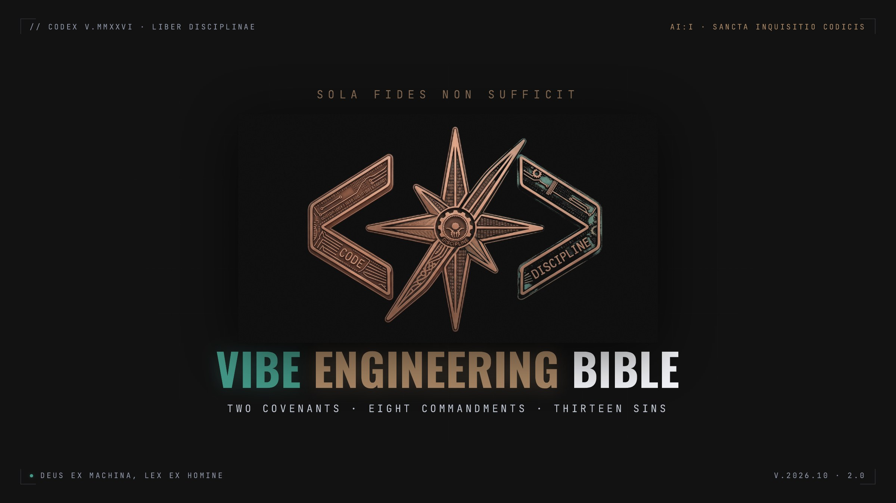

# Vibe Engineering Bible

A policy for working with AI assistants (Claude Code, Cursor, Codex, Claude Cowork,
and others) for teams of any size — solo developer, OSS maintainer, a team of 5
or 5000 people.

The repository is meant to be a **point of righteousness**: a git-first source of rules,
templates, and playbooks with which you can initialize a new project, audit an existing
one, run a pre-PR review, and feed useful findings back into the bible.

This is a documentation-only repo: no code, tests, or build here.

**Version 2.0 · October 2026.** What changed and why — Appendix E of the bible and
[`docs/adr/0001-bible-2.0.md`](./docs/adr/0001-bible-2.0.md).

## Contents

- **[`vibe-engineering-bible.md`](./vibe-engineering-bible.md)** — the canonical "bible". Two covenants: the **Covenant of Freedom** — experiment mode (T0) with three unbreakable boundaries; the **Covenant of Discipline** — engineering mode for everything someone other than the author uses, with risk tiers T1–T3 and an event-triggered transition. Inside — eight commandments, thirteen sins (§4½, a normalized shortcode vocabulary for merge rejections), DoD by tier with gate classes, the loop "spec → agent → verification → rollout → outcome", an AI-code reviewer checklist, context files and development-agent skills, metrics and ownership, glossary. Sources for figures — Appendix D; standard evolution — Appendix E; applying the bible to projects — Appendix F.
- **[`usage.md`](./usage.md)** — how to apply the repo to live projects: roles, four application modes, two classes of checks, playbooks as development-agent skills, artifacts.
- **[`playbooks/`](./playbooks/)** — operational scenarios: init of a new project, audit of an existing one, pre-PR/PR review, a proposal to change the bible. Each can be shipped as a `SKILL.md`.
- **[`templates/CLAUDE.md.template.md`](./templates/CLAUDE.md.template.md)** — baseline template for AI agents in a product repo. Applies to a team of any size.
- **[`templates/`](./templates/)** — forms for applying the bible: audit report, init result, registry entry, bible change proposal.
- **[`patterns.md`](./patterns.md)** · **[`registry.md`](./registry.md)** · **[`CONTRIBUTING.md`](./CONTRIBUTING.md)** · **[`docs/adr/`](./docs/adr/)** — the **standard-evolution** mechanism (Appendix E): an advisory catalog of field patterns and a queue of sin candidates, the adoption registry (opt-in), the upstream contribution process, reasoned ADRs on core changes. The core grows only through the gate; contribution is opt-in and human-confirmed.

## How to use

**If you are applying it to a project.**

1. Open [`usage.md`](./usage.md).
2. Choose the mode:
   - a new project — [`playbooks/init-project.md`](./playbooks/init-project.md);
   - an existing project — [`playbooks/audit-project.md`](./playbooks/audit-project.md);
   - a diff/PR — [`playbooks/review-pr.md`](./playbooks/review-pr.md);
   - a new rule from practice — [`playbooks/propose-bible-change.md`](./playbooks/propose-bible-change.md).
3. For T1+, copy [`templates/CLAUDE.md.template.md`](./templates/CLAUDE.md.template.md) into the product repo as `CLAUDE.md` (Claude Code) and/or `AGENTS.md` (Codex, Cursor, and others that support `agents.md`).
4. Fill in the placeholders in §1–§3 of the baseline — including §3.1 "what the environment enforces" — and section 8 ("Repo-specific"). Do not edit the rules in §4–§7 locally. Keep the file short: only the non-obvious, target ≤~150 lines; what is mandatory goes into agent settings, hooks, and CI.
5. After the first real application, add the project to [`registry.md`](./registry.md).

Cross-reference your tier's DoD (T1/T2/T3) against §5 of the bible.

**External readers.** The bible core (§§1–10) is self-contained: two covenants and risk tiers, eight commandments, thirteen sins with shortcodes, a DoD table with gate classes, the loop, a reviewer checklist, metrics. Appendix D — sources; Appendix E — how the bible grows; Appendix F — how to apply it to projects.

**Contributors (editing the bible, the template, playbooks).**

- **Found a generalizable pattern or want to be in the registry?** Don't edit the core directly — there is an upstream path (opt-in, a human confirms the PR): see [`CONTRIBUTING.md`](./CONTRIBUTING.md). Field patterns go in [`patterns.md`](./patterns.md), applications in [`registry.md`](./registry.md).
- Reflect process changes in `usage.md` / `playbooks/` first; carry into the bible core only stable norms — through the Appendix E gate and a reasoned ADR in `docs/adr/`.
- When editing any file, check the others for semantic consistency — the cross-file mapping is documented in [`CLAUDE.md`](./CLAUDE.md) (project instructions).
- Editing principles: brevity over completeness, imperative over description, concrete over ideological. See `CLAUDE.md` for details.
- Sources for figures in §1 and §4½ live in Appendix D of the bible. Change figures only when a newer version of the research appears, and update the link in the same commit.
- Commits follow Conventional Commits (`feat`, `fix`, `chore`, `docs`).

## Owner

The owner group of the AI-code policy in your team or organization (a small group, one owner per part; in a small team — the owner-developer) and the harness owner. The quarterly review of the bible and the template removes what is outdated, not only adds.
